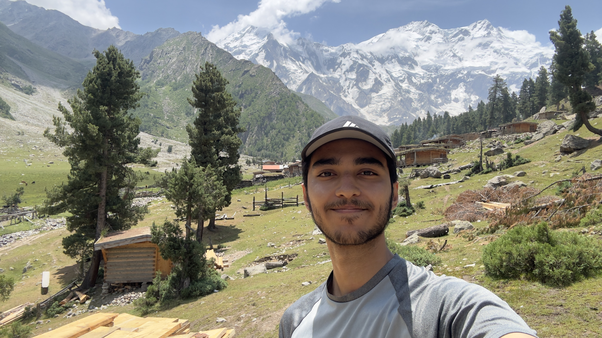

# Muhammad Hasan

I'm an undergraduate at McMaster University. Started with EV3 Mindstorms and Arduino/Raspberry Pi stuff, now I spend most of my time thinking about system design - how to build things that scale and don't break under load.

Wrote an HTTP server in C++ to figure out how the web actually works, built full-stack apps where I learned about caching and database optimization, and lately I've been digging into distributed systems and backend architecture.

{ .profile-img }

---

## What I'm Working On

Right now I'm building and maintaining MacTrack, a platform for McMaster students that combines course exploration, degree planning, GPA tracking, and seat monitoring in one place. The system runs in production and currently tracks hundreds of active course watches with automated email notifications when seats open.

Also working on a distributed task queue system. Built the task abstraction with serialization and retry tracking, designed the queue interface with priority handling, and set up the storage backend abstraction. Next up is implementing the Redis backend and worker/consumer logic. It's forcing me to think through how message queues actually work at a lower level. 

## Experience

**Vice President, Robotics Club** - Beaconhouse Margalla Campus (Sept 2023 - Apr 2024)

Led workshops for 15+ club members on Arduino programming, sensor integration, and embedded systems. Teaching this stuff forced me to actually understand it properly.
